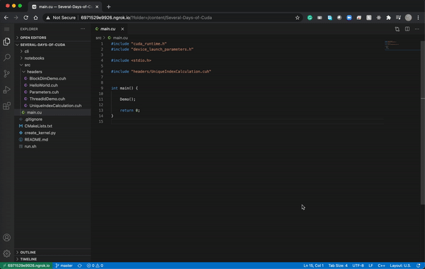

# Several Days of Cuda

## Instructions

### Instructions for running locally

1. Download and install cuda toolkit for your platform.

2. Check the GPU you're using by `nvidia-smi -L`.

3. Use `run.sh <CUDA_VERSION>` to build and run if you're on Linux. If you are on Windows, clone and open us the directory using Visual Studio 2019 and build using CMake.

### Instructions for running on google colab

1. Run the `Cuda_Workspace.ipynb` Notebook on Google Colab [](https://colab.research.google.com/github/soumik12345/Several-Days-of-Cuda/blob/master/notebooks/Cuda_Workspace.ipynb)

2. Check the GPU you're using by `nvidia-smi -L`.

3. If you wish to ssh into the colab instance from your local VSCode, follow the instructions for `VSCode Remote SSH`. For setting up ssh connection between local VSCode to Google Colab, please follow the instructions this article: [Connect Local VSCode to Google Colab’s GPU Runtime](https://medium.com/swlh/connecting-local-vscode-to-google-colabs-gpu-runtime-bceda3d6cf64).

4. `cd /content/Several-Days-of-Cuda` and use `run.sh <CUDA_VERSION>` to build and run either on the Google Colab Terminal (if you're using Colab Pro) or on the VSCode in-built terminal.



### Instructions for Development

In order to add a new program to the codebase, you can use a simple Python CLI. Simply install the required 
dependencies for the CLI using `python3 -m pip install -r requirements.txt`. Now you can use the CLI to add a new 
example to the codebase. Executing the `create_kernel.py` using the necessary parameters would add a cuda header file 
with some simple starter code. The usage of the CLI is described below:

```
Usage: create_kernel.py [OPTIONS]

Options:
  -k, --kernel_name TEXT          Kernel Name
  -s, --source_name TEXT          Source Name
  -m, --memory_allocation [auto|manual]
                                  Enable Automatic Memory Allocation
  --help                          Show this message and exit.                       Show this message and exit.
```

## Programs

1. [Hello World](./src/lib/HelloWorld.cuh): Print Hello World in a cuda kernel. 

2. [Accelerated For Loop](./src/lib/BasicExamples/ParallelizedLoop.cuh)

3. [Accelerated For Loop with Multiple ThreadBlocks](./src/lib/BasicExamples/ParallelizedLoopMultipleBlocks.cuh)

4. Array Manipulation: 
   
   - [Automatic Memory Allocation](./src/lib/BasicExamples/ArrayManipulation.cuh)
   
   - [Manual Memory Allocation](./src/lib/BasicExamples/ArrayManipulationManualMemoryAllocation.cuh)

5. Fibonacci Sequence:
   
   - [One to One Mapping](./src/lib/BasicExamples/Fibonacci.cuh): Generate Fibonacci Sequence using one-to-one mapping.
   
   - [Dynamic Programming](./src/lib/BasicExamples/FibonacciDynamicProgramming.cuh): Generate Fibonacci Sequence using 
   Dynamic Programming.
